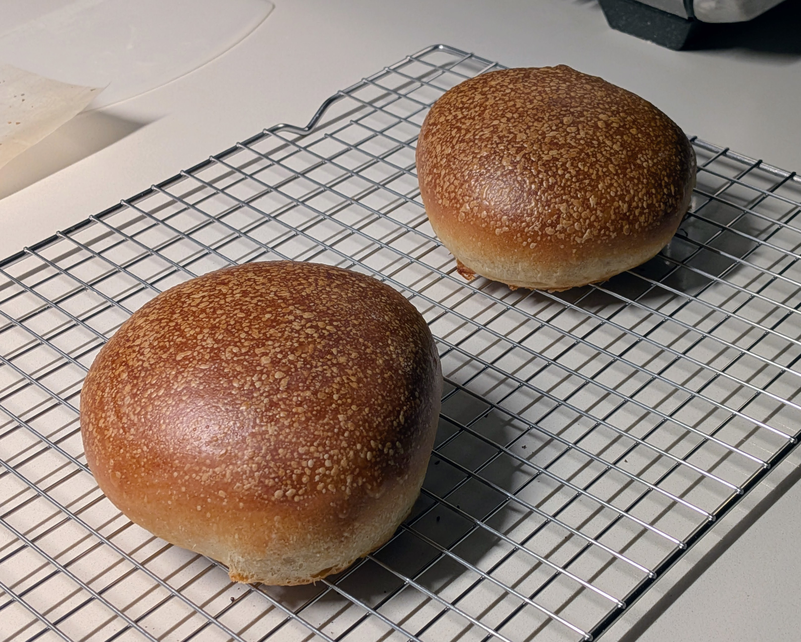

# Hamburger buns for one

Goals:
- I don't want to use fractional eggs
- I want to make enough for one day but no more
- I don't want to clean up egg wash or a butter brush

# Ingredients

- 142g flour
- 89g water or milk. If using milk, don't use a lot maybe 10-20g
- 10g oil
- 6g sugar
- 4g salt
- 1-2g yeast

Makes 2 buns (125-130g pre-bake). Hydration is 60-65%.

## Variations

- 20-30g of starter, just offset the flour and water accordingly. I'm lazy about my calculations and just assume it's 100% hydration starter even though it isn't, and I don't offset my yeast by much

# Steps
- Mix and knead like a regular dough. Rise until about doubled
- Split into two, stretch it out a little, fold into the center, then roll into balls.
- Let rest for 10 minutes or so then squish them flat. Resting is needed to relax the gluten after handling
- I proof for about an hour at 100 F
- Brush the tops with milk
- Bake at 380 for about 20 minutes
    - Notes for convection toaster: I like to have convection on for the first minute after putting them in, then switch to non-convection so that they don't dry out as much. I use a middle rack and bake on parchment on an aluminum sheet pan.

# TODO
- The hydration amount sounds wrong, given the actual recipe