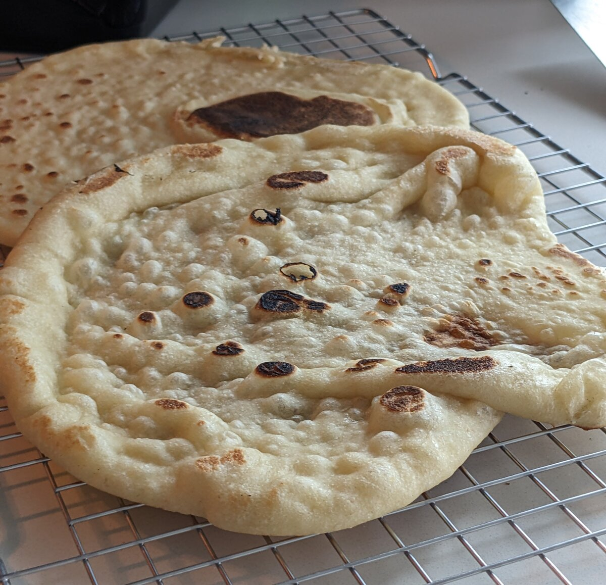

# Naan

Makes 4-6 naan

Adapted from [Food Wishes](https://foodwishes.blogspot.com/2019/02/garlic-naan-now-100-tandoor-free.html)

## Ingredients

- 115g water (1/2 cup)
- 4g sugar (1 tsp)
- 3g yeast (1 tsp)
- 6g salt (1 tsp)
- About 12g oil (1 tbsp; butter is ok too if melted, softened, or grated)
- 85g plain yogurt (half a 6 oz container, about 1/3 cup)
- About 265g flour (2 cups)

<cook-mode-toggle></cook-mode-toggle>

## Steps

### Dough
- Bloom the yeast with water and sugar (mix and wait 5 min)
- Add the rest of the stuff, mixing well, then kneading
- Divide into 4 balls and let them rise

### Cooking
- Flatten each with a rolling pin until pretty thin
- Cook on a hot cast iron - for me, setting 7 on the medium sized burner works. It helps to cover it while cooking. It only takes a minute or so per side.

## Tips
- Stick to cast iron - the toaster oven doesn't get the right color at all, even on max heat with convection.
- For garlic butter: use more garlic than you think and add a pinch of salt.

## Adjustments
- Yogurt: If plain isn't available, lemon or lime works well