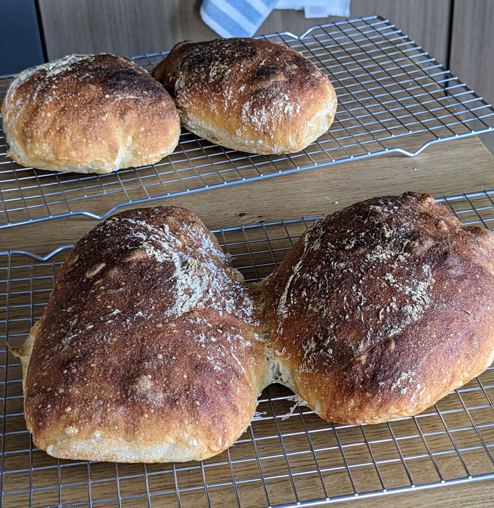
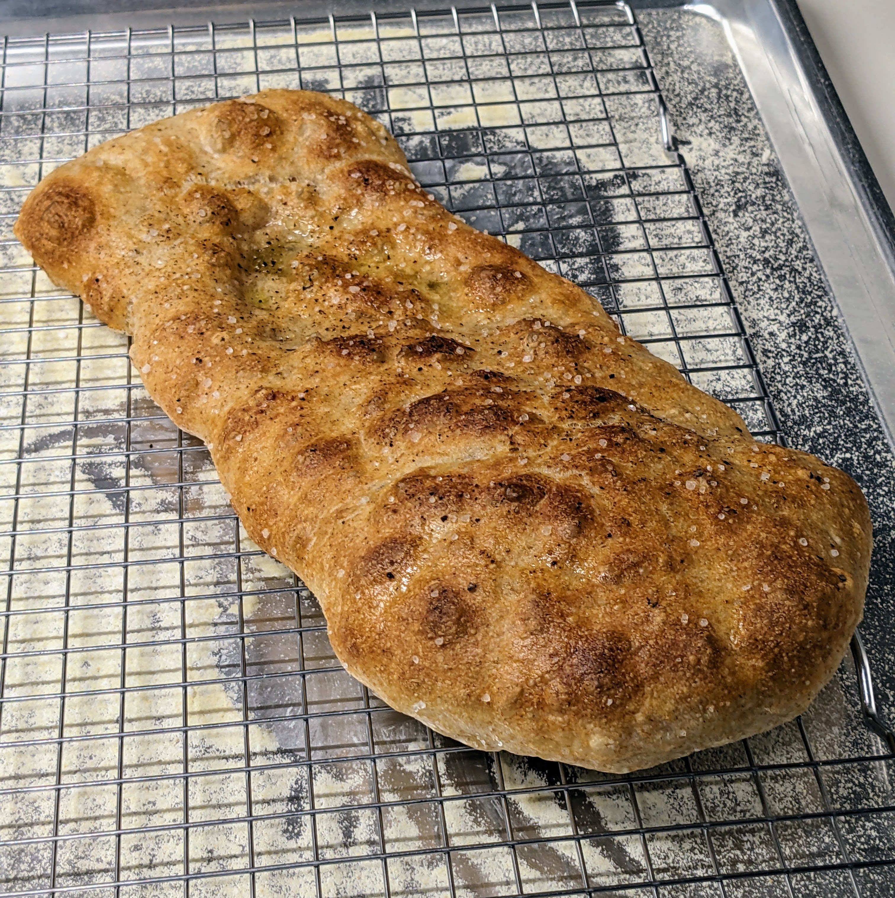

# Pan de cristal

Adapted from Martin at King Arthur Flour, halved

## Ingredients

- [ ] 250g water
- [ ] 250g bread flour
- [ ] 3/8 tsp yeast (1.25g)
- [ ] 1 tsp salt (5g)

<button id="cook-toggle" class="cook-off">
  Cook mode: OFF
</button>

## Directions

- Need to bowl-fold with wet hands because it's too high hydration to knead regularly
- Switch to coil folds if possible

## Tips

- Get a big tupperware, mix in that, then fold in that
- Can replace 50-100g of water/flour with starter for better flavor. Reduce yeast a little if doing that
- Can add 25-50g of rye, wheat, or spelt to give a more complex flavor

## Shaping variations

### Regular PdC

I forget exactly but it's shaped something like choco croissants.

### Pizza bianca

When shaping, make it into a shape sorta like choco croissants. Do that on lots of semolina. Then rest for 30-60 min. Then stretch/flatten it. Then dimple it and drizzle olive oil and top with pepper and coarse salt. Garlic powder works wonders too.

Bake at 450+ for 18-20 min. In the toaster, use super convection.