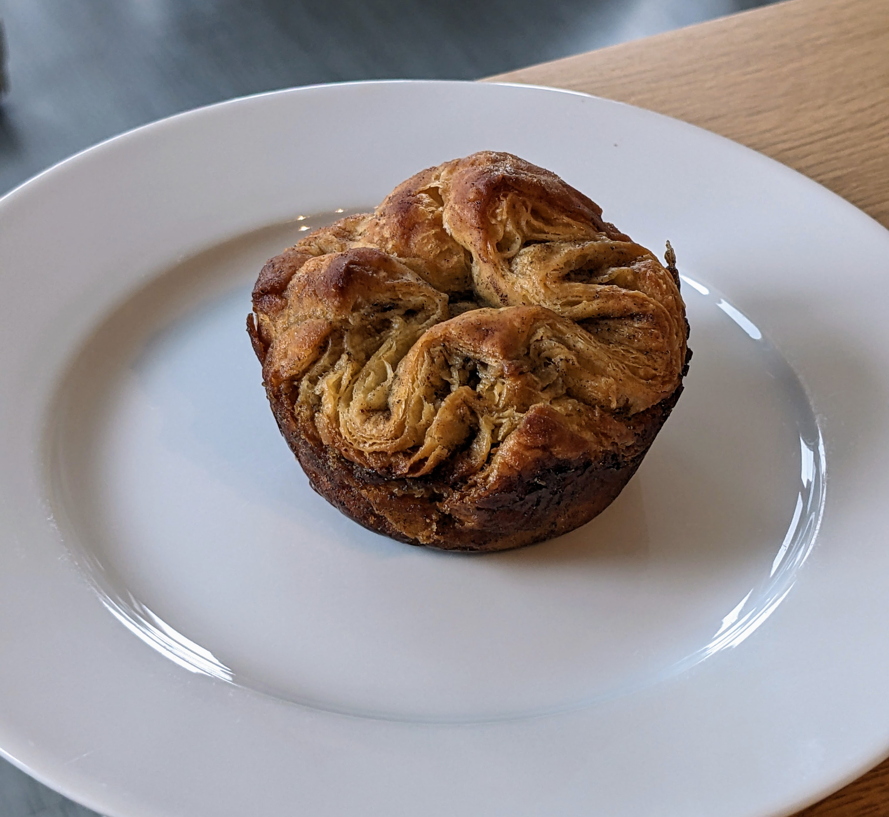
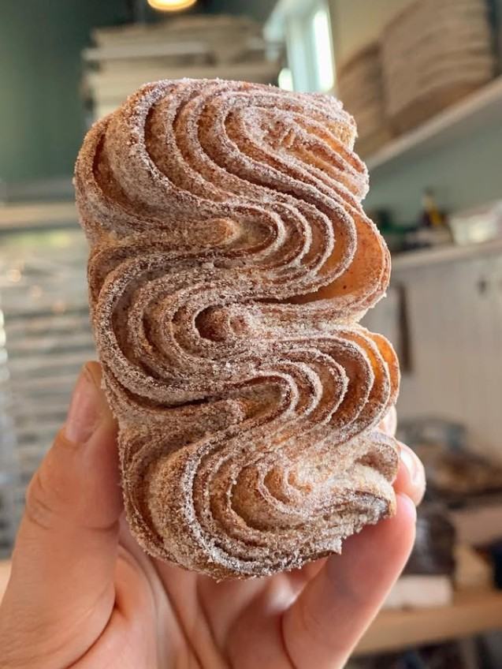
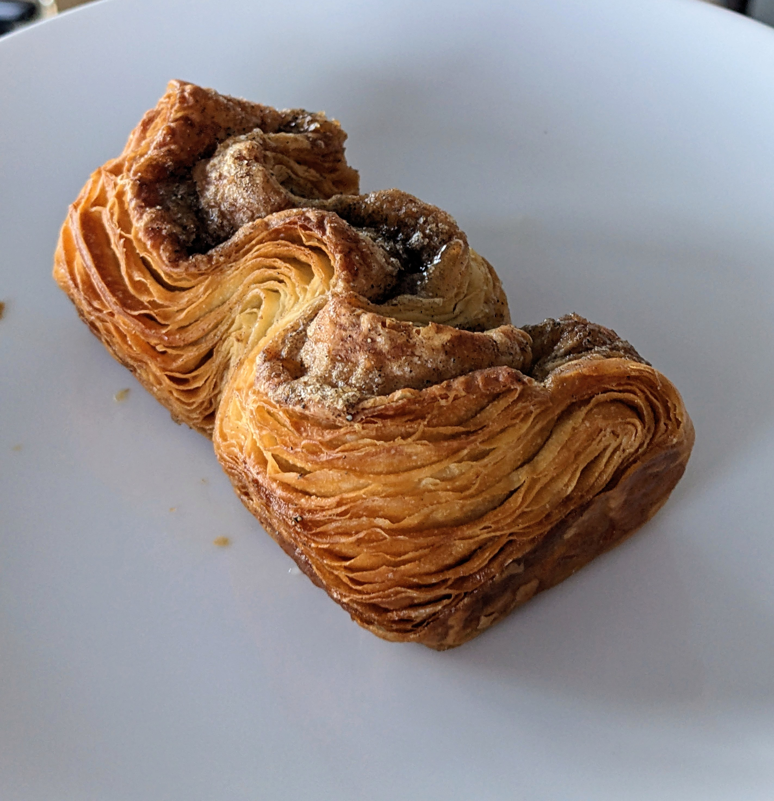

# Kouignette (mini Koiugn Amann)
Adapted from [Claire Saffitz](https://www.youtube.com/watch?v=Mb9OBQhWucA)

## Ingredients

### Dough
- 1 tsp yeast
- 1/4 cups sugar
- 1 cup room temp water
- 3 tbsp melted, cooled butter, or just grated butter into the lukewarm dough
- 1 1/2 tsp salt (5g)
- 423g flour

### Butter block
- 3 sticks salted butter (340g)

### Other
- About 1 cup sugar in the lamination and pan
- ~2 tbsp butter to brush the pan

## Steps
- Make the dough, let it double (preferably cold ferment overnight for flavor)
- Make a 7x7" butter square
- Roll the dough into a square that can include the butter square rotated 45 degrees
- Fold it into a packet
- 2 folds, then refrigerate 1 hour, then 2 more folds (this time including the sugar)
- Roll out to 12x18, cut into 3x3 squares (small muffin tin) or 6x6 squares (big muffin tin)
- Shape into pan, let rise (preferably cold ferment)
- Bake at 350 for 30-40 min. Check every 10 min, rotate, etc

## Tips
- The size of the squares needs to be proportional to the size of the tin. If it's too small, they'll just flatten into squares
- Cheese grater for hard butter. Mark the 7x7 on the wax/parchment paper and shape to that
- Pizza wheel for cutting the dough, trimming the dough edges to make it more rectangular. This also helps to get nicely flaky edges
- Butter the pan, dust heavily with sugar, shake, invert to get the excess out
- Dislodge them from the pan immediately with chopsticks. Remove after 2-4 min once they've firmed up a bit
- Cool inverted on a wire rack
- Exercise a lot
- You can freeze the cooked kouignettes in little bags and reheat at 325-350 for 8-12 min

## Variation: Wavy Croissant
This is inspired by Saint Bread's Cardamom Croissant. I couldn't find any official name for this shape anywhere. It's rectangular with the lamination layers pointed upwards in a wavy pattern.

If you're doing this, you'll need to calculate the size of the rectangle based on the size of your pan. (See below)

1. Roll dough so short side is about 24 cm
2. Cut strips about 6 cm wide
3. Butter pan and line with parchment
4. Sprinkle sugar and spices on dough strip
5. Fold strip in half lengthwise
6. Fold 4 times on table before transferring to pan
7. Bake as above for 40 minutes

### Calculation notes

- Pan dimensions: 3cm deep × 6.5cm wide × 11cm long
- Dough thickness: 1cm -> folded in half = 2cm -> with 50% rise = 3cm
- Folds needed: 11cm ÷ 3cm = ~4 folds
- Depth needed: 3cm deep × 2 = 6cm
- Required width: 4 folds × 6cm = 24cm
- **Final rectangle needed: 6cm × 24cm**

This estimate worked pretty well BUT it's definitely imperfect.

### Attempt 1

Went well
- The shape looked great
- Adding the cardamom sugar into the last fold and sprinkling worked reasonably well
- The calculation of the 2D shape from the 3D shape worked surprisingly well

Not so well
- A bit too buttery?
- The non-sugar one rose perfectly but the sugar ones didn't as well. I don't know if it's because of the sugar somehow, like keeping some parts from baking, or if I just didn't cut them all identically. It could also be because the non-sugar one was an end piece which had more dough
- Initially I folded it into the pan, but that would move the parchment paper. I found it was easier to fold it on the table and then move it to the pan
- I don't think the cardamom sugar was enough. I should've sprinkled some on the bottom and also included some in the last butter fold.